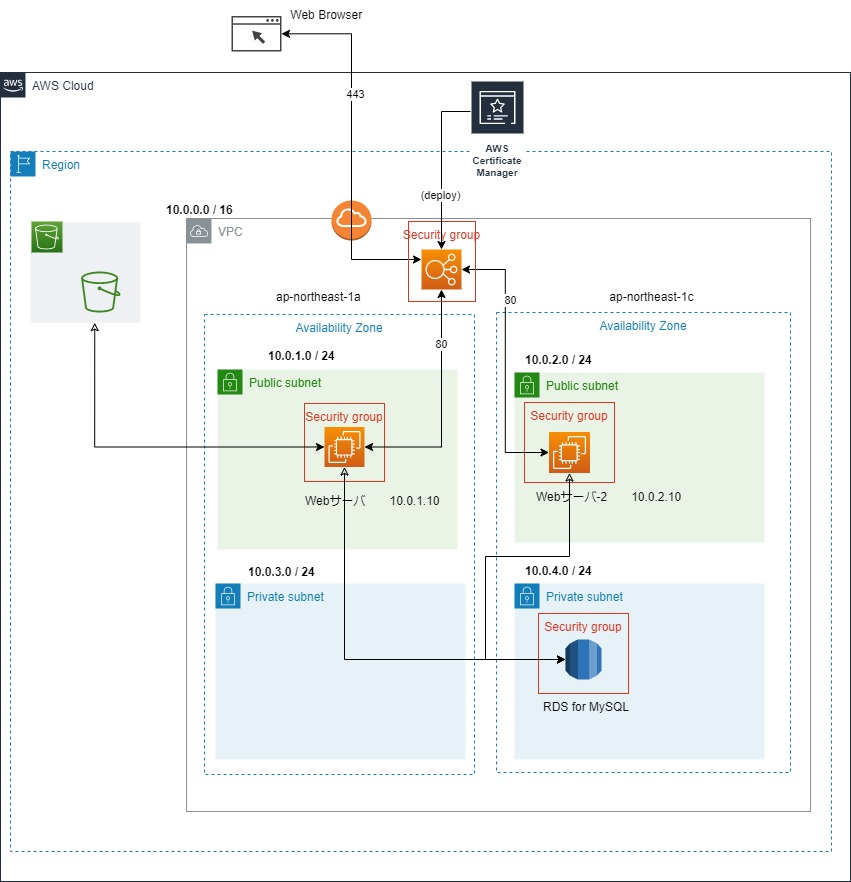

# 概要
AWSとIac（Infrastrucure As Code）の課題用リポジトリです。
RubyOnRailsで自作した地図関連アプリのインフラ構築用コードを下記内容にて作成しました。
  - AWS CloudFormationテンプレート
  - Ansibleでのアプリ構築・設定
  
# 対象アプリ
  - アプリ名　  
      SiteInformation-Tool (場所の登録アプリ)　 *RubyOnRails/GoogleMapAPI/MySQL/Nginx/Unicorn
  - URL　       
      [https://smooth-running2.org](https://smooth-running2.org)
  - リポジトリ  
      [https://github.com/tshima2/smr2_app](https://github.com/tshima2/smr2_app)

# アプリ構成
  - AWS使用リソース  *EC2/RDS/S3/ELB/ACM
  -          
